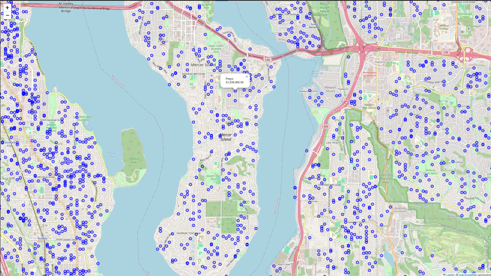

# 🏠 Predição de Preços de Imóveis - King County, USA

## 📊 Visão Geral do Projeto
Desenvolvimento de um modelo preditivo para preços de imóveis utilizando dados do condado de King, USA, aplicando técnicas avançadas de análise exploratória e machine learning.

### Situação
O mercado imobiliário de King County necessitava de um sistema preciso para predição de preços de imóveis, considerando múltiplas variáveis e características específicas da região. A volatilidade do mercado e a complexidade das avaliações manuais demandavam uma solução automatizada e confiável.

### Tarefa
- Desenvolver análise exploratória robusta dos dados imobiliários
- Criar modelo preditivo com alta precisão
- Identificar principais fatores que influenciam os preços
- Sugerir implementação de sistema de avaliação automatizada e insights.

## 💻 Notebook's

[Análise Exploratória dos Dados](https://github.com/alexassuncaodados/Analise_e_Predicao_Imoveis/blob/main/notebooks/01-EDA.ipynb)

[Modelo de Machine Learning](https://github.com/alexassuncaodados/Analise_e_Predicao_Imoveis/blob/main/notebooks/02-Modelo.ipynb)

## 📊 Dashboard
[Dashboard de Análise Imobiliária](https://github.com/alexassuncaodados/Analise_e_Predicao_Imoveis/tree/main/src/dashboard)

### Ação
#### 1. Análise Exploratória (EDA)
- Limpeza e preparação dos dados
- Análise estatística descritiva
- Visualização geoespacial com Folium
- Identificação e tratamento de outliers
- Análise de correlações

#### 2. Modelagem
- Implementação de pipeline de machine learning
- Otimização de hiperparâmetros via Bayesian Search
- Validação cruzada
- Avaliação comparativa de modelos

### Resultados
- R² superior a 0.9077
- RMSE otimizado para diferentes faixas de preço
- Identificação das principais features que impactam o preço
- Visualização clara dos resultados
- Análise de resíduos

## 🛠️ Tecnologias Utilizadas
- Python 3.x
- Pandas & NumPy
- Matplotlib & Seaborn
- Scikit-learn
- Random Forest
- XGBoost
- Folium
- Kaggle API
- Streamlit
- Plotly
- Bayesian Optimization

## 📈 Principais Insights

### Fatores de Maior Impacto
1. **Características Físicas**
   - Área habitável
   - Qualidade da construção
   - Número de cômodos

2. **Localização**
   - Coordenadas geográficas
   - Código postal
   - Características da vizinhança

3. **Aspectos Qualitativos**
   - Estado de conservação
   - Vista
   - Amenidades

## 💡 Conclusões Principais
- Modelo alcançou alta precisão na predição de preços
- Identificação clara dos principais feautures
- Análise de resíduos indicou boa adequação do modelo
- Visualizações geoespaciais facilitaram a compreensão dos dados
- Análise de correlações revelou insights valiosos sobre a relação entre variáveis
- Sistema robusto para diferentes faixas de preço
- Potencial para aplicação em tempo real

## 🔄 Próximos Passos
1. Implementação de API REST
2. Integração com dados macroeconômicos
3. Desenvolvimento de interface web
4. Sistema de monitoramento contínuo

## 👤 Autor Alex Silva de Assunção
- [LinkedIn](https://www.linkedin.com/in/alexassuncaodata/)- [GitHub](https://github.com/alexassuncaodados)
## 📫 Contato
- Email: [alexassuncao.dados@email.com](mailto:alexassuncao.dados@email.com)