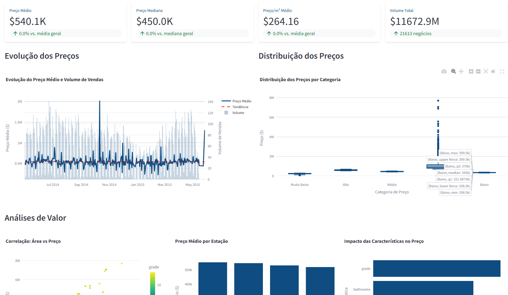
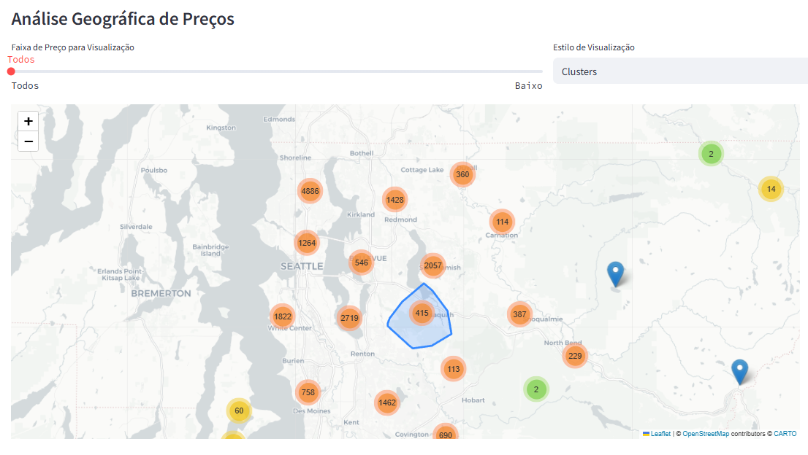
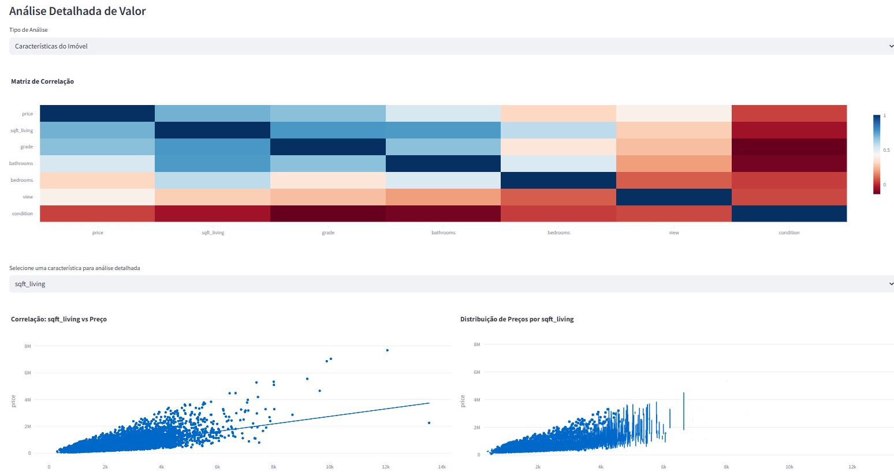

# Dashboard - Análise do Mercado Imobiliário

Este diretório contém a aplicação do dashboard desenvolvida com Streamlit para análise do mercado imobiliário.


## Principais Funcionalidades

### 1. Visão Geral (📊)
- Métricas principais (preço médio, mediano, etc.)
- Análises temporais de vendas
- Distribuição de preços por características do imóvel
- Estatísticas de mercado

### 2. Análise Geográfica (🗺️)
- Mapa de calor de preços
- Distribuição geográfica dos imóveis
- Análises por região

!

### 3. Análise Detalhada (📈)
- Correlações entre variáveis
- Tendências de mercado
- Análises específicas por características do imóvel


## Filtros Disponíveis

- Período de análise
- Faixa de preço
- Área habitável
- Filtros avançados:
  - Grade (qualidade do imóvel)
  - Condição
  - Vista

## Tecnologias Utilizadas

- Python
- Streamlit
- Pandas
- Plotly
- Folium
- Numpy

## Como Executar

1. Certifique-se de ter todas as dependências instaladas do projeto no ambiente virtual.:
```bash
pip install -r requirements.txt
```

2. Execute o dashboard:
```bash
streamlit run src/dashboard/app.py
```
## Estrutura de Dados

- Conversão de datas
- Cálculo de métricas derivadas (preço por mt quadrado, idade do imóvel, etc.)
- Categorização de preços
- Cálculos de métricas sazonais


